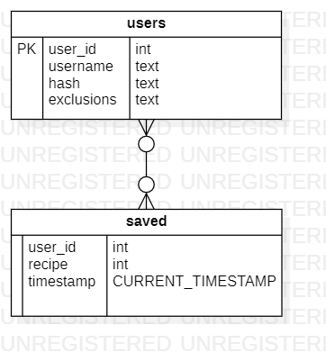

# WhatTheFridge
## Studenten
**Jesse Kassai** - 12814083

**Rico Lücken** - 12870692

**Stijn Michiels** - 12716979

**Huib Wolse** - 12665142

# Projectplan
## Samenvatting
Met behulp van onze applicatie kan je recepten vinden met ingrediënten die je in huis hebt. De ontbrekende ingrediënten worden getoond als lijst. Je kan de resultaten filteren op vlees, vis en groentes. Je kan ook je favoriete recepten opslaan en delen met een andere gebruiken. Zo bespaart men geld en gaan we voedselverspilling tegen. Je kan de resultaten sorteren op bereidingstijd, prijsklasse en aantal extra benodigde ingrediënten. Deze applicatie is voornamelijk bedoeld voor studenten en helpt voedselverspilling tegen te gaan.
## Features
- **Vind een recept op basis van ingrediënten (automatisch aanvullen bij zoeken ingredient)**
- Filter resultaten op vegetarisch, veganistisch en/of glutenvrij.
- **Sla je favoriete recepten op**
- **Deel recepten op sociale media**
- **Sorteren op bereidingstijd, prijsklasse en aantal extra benodigde ingrediënten**

_Vetgedrukt = MVP_
## Afhankelijkheden
### API
Food API: [https://spoonacular.com/food-api](https://slack-redir.net/link?url=https%3A%2F%2Fspoonacular.com%2Ffood-api)
AH API: [https://www.ah.nl/partnerprogramma](https://slack-redir.net/link?url=https%3A%2F%2Fwww.ah.nl%2Fpartnerprogramma)
### Frameworks
- Bootstrap
- flask
- Javascript (+JQuery)
- GitHub
- Code Editing Software met Git-support

### Concurrentie
- Receptenzoeker.com
- Smulweb
- AH Recepten

### Uitdagingen
API-integraties, filteren, sharing, zoekresultaten verwerken (sorteren?)

# Technisch ontwerp
## Controllers
- "/" - Home (not logged in) - splashpage (GET)
- "/register" - Register (not logged in) - registratie voor gebruikers (GET/POST)
- "/onboarding" - Onboarding - profiel compleet maken (voorkeuren) na registratie (GET/POST)
- "/login" - Login (not logged in) - inloggen (GET/POST)
- "/search" - Zoekopdracht - ingredienten invullen en zoek button (GET)
- "/results" - Zoekresultaten - resultaten van zoekopdracht tonen (POST)
- "/profile" - Profiel - bewerken profiel, voorkeur qua dieet, wachtwoord (GET/POST)
- "/favorites" - Favorieten - bekijk opgeslagen recepten (GET)
- "/support" - FAQ/Contact - veelgestelde vragen/contact e-mail (GET)

_Default is authentication required_

## Screenshot

## Product video

## Models/helpers
- login_required - herleid gebruiker naar login pagina als authenticatie vereist is
- server_error - verzorgt error pagina bij fout
- lookup - doet een aanvraag bij de FoodAPI
- lookup_recipe(id) - zoekt in de FoodAPI een recept op basis van een ID.

## Plugins en frameworks
- Bootstrap - [Docs](https://getbootstrap.com/docs/4.4/getting-started/introduction/)
- Flask - [Docs](http://flask.palletsprojects.com/en/1.1.x/)
- Jinja - [Docs](https://jinja.palletsprojects.com/en/2.10.x/)
- JQuery (+ JS) - [Docs](https://api.jquery.com/)

## Repository Guide
Static: bevat afbeeldingen, style en Javascript-bestanden

Templates: bevat HTML-bestanden 

Hoofd-map: bevat application.py en helpers.py (core-bestanden) (& README.md)

## ERD

In deze ERD-diagram zijn twee tabellen te zien. In de bovenste tabel worden
gebruikers geregistreerd door middel van een UserID, een username, een gehashed wachtwoord
en hun voorkeuren voor een specifiek dieet.

In de onderste tabel worden de recepten die de gebruiker wilt opslaan, opgeslagen. Verschillende gebruikers kunnen meerdere
gerechten opslaan per gebruiker. Vandaar de keuze voor een many-to-many verband.
